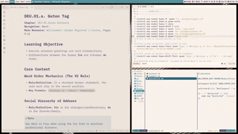

# Welcome to my dotfiles! 🍜

Very simple 'rice' using the [river](https://github.com/riverwm/river) window manager.

### Quick Demo 🎥



## Features 🍥 

- **Theme Engine:** Functional light/dark mode system toggle using dark Gruvbox and Rosé Pine Dawn.
- **Media:** Comprehensive MPRIS integration with `waybar`, `mpd`, and `playerctl`.
- **File Management:** `yazi` for terminal browsing and `thunar` for GUI.
- **Utilities:** Wallpaper switching (`swww`), system monitoring (`btop`, `cava`), and brightness/audio controls.

## Installation 🛠️

To get access to the Scripts, just move the [Scripts folder](./Scripts/) into your home directory

1. Clone the repo: 
`git clone https://github.com/wakuroshi/dotfiles`
3. Enter the directory: 
`cd dotfiles`
5. Make the script executable: 
`chmod +x install.sh`
7. Run: 
`./install.sh`

Also, I configured this taking into account you have a **Media** folder in your home directory, I don't include the creation of these folders on the install script as that is easily configurable.

```
Media/
 ├── Pictures/
 │    ├── Screenshots/
 │    └── Wallpapers/
 └── Music/
```

## Keybinds ⌨️

Properly commented in [river init file](./.config/river/init)

| Key combination | Command | Dependency |
| :--- | :--- | :--- |
| **Super + Q** | Launches terminal | `kitty` |
| **Super + C** | Closes focused process | `river` |
| **Super + Shift + E** | Exits river session | `river` |
| **Super + M** | Toggles light/dark mode | `Scripts/toggler.sh` |
| **Super + W** | Wallpaper selector | `Scripts/wallswitch.sh` |
| **Super + A** | Restarts waybar | `Scripts/restart.sh` |
| **Super + Z** | Launches wofi (drun) | `wofi` |
| **Super + D** | Launches file manager | `yazi` |
| **Super + Print** | Full Screenshot | `grim` |
| **Super + Ctrl + Print**| Area Screenshot to Clipboard | `slurp` + `wl-copy` |
| **Super + F1-F12** | Media & System Controls | `pamixer`/`playerctl` |

